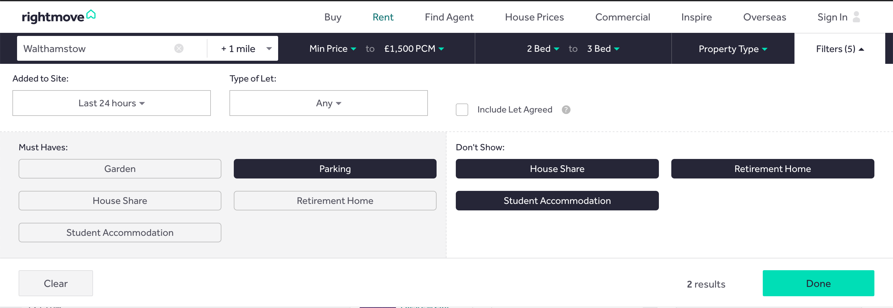
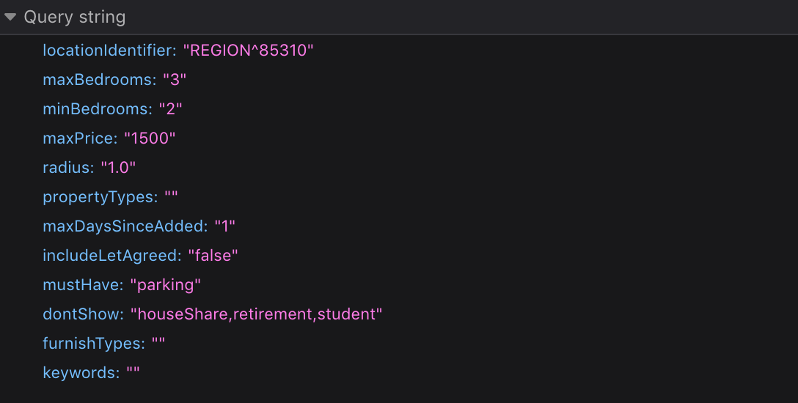
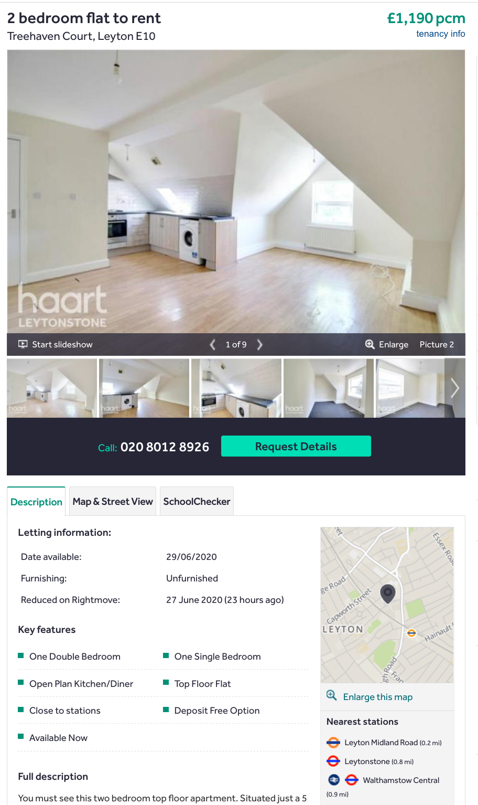
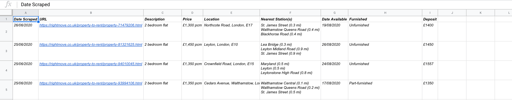

[Source Code](https://github.com/JordWyatt/rightmove-by-notice-period)

### The Problem

---

Finding property is monotonous, there is no question about it.

[RightMove](https://rightmove.co.uk) is, as far as I'm aware, the most popular property search site in the U.K. I'd been spending a lot of time on the site trying to search for a new rental whilst working around my agreed 8 week notice period.

This process involved (for each potential location):

1. Performing a search
2. Setting up a daily email alert for new properties
3. For each property in the daily alert email
   1. Check if the listing has its date of availability listed
   2. Ensure this date is at least 8 weeks away from the current date

Most of the time the properties were available sooner than needed which was not only a waste of time, but created cycles of excitement and disappointment.

I couldn't be bothered anymore. The lack of ability to filter on 'Date Available' was driving me mad, so I decided to automate the process.

### Finding Candidate Properties

---

To scrape RightMove I used Python in conjunction with [BeautifulSoup](https://www.crummy.com/software/BeautifulSoup/bs4/doc/). To anyone who is familiar with either of these technologies the contents of this post will probably bore you, however, as someone who had only used Python for a brief period during my degree this felt like the perfect learning opportunity.

For those unfamiliar, BeautifulSoup is a Python package for parsing HTML. It creates a parse tree for parsed pages which allows developers to easily extract information from HTML by traversing the tree.

The first step was to add the ability to configure and perform searches to provide the results page containing listings for scraping.

Let's disect a manual search to see the necessary components:



The above search generates a request to https://www.rightmove.co.uk/property-to-rent/find.html with the following query string parameters



Most of this is self explanatory and uninteresting, one thing that did stick out is the location identifier. RightMove appear to use their own propriatary region identifiers which would need to be provided in configuration for each location I wanted to search over.

Once I'd nabbed the appropriate location identifiers and popped them in a configuration file, I was able to write the function to perform a search over these location identifiers to retrieve the search result pages for each location. The result pages were then processed using the `get_listing_urls` function to pull the URL for each property in the result set.

`config.ini`

```
[locations]
identifiers = REGION^93802,REGION^87521

[filters]
availableAfterNWeeks = 7
radius=1
minPrice = 0
maxPrice = 1500
minBedrooms = 2
maxBedrooms = 3
dontShow=houseShare,retirement,student
furnishTypes=unfurnished,partFurnished
```

`rightmove_scraper.py`

```python
   def scrape_listings(self, location_identifiers):
      listings = []
      for identifier in location_identifiers:
         url = self.build_search_url(identifier)
         listings.extend(self.scrape(url))

      listings = self.remove_duplicate_listings(listings)
      return listings

   def build_search_url(self, location_identifier):
      parameters = config.items('filters')
      parameters.append(("locationIdentifier", location_identifier))
      search_url = self.base_search_url + urlencode(parameters)
      return search_url


   def scrape(self, url):
      html = requests.get(url).text
      listing_dom = BeautifulSoup(html, 'html.parser')
      location = self.get_location_name(listing_dom)

      print(f"Scraping properties in {location}...")

      listing_urls = self.get_listing_urls(listing_dom)
      listings = [Listing(url) for url in listing_urls]

      for listing in listings:
         listing.scrape_details()

      return listings
```

### Scraping Property Information

---

In the above snippet `listing_urls` is a list containing URLs for each property returned from a search over a specific location identifier. The HTML returned from each of these URLs needed to be scraped to extract information relevant to my search.

Here is an example of a property listing on RightMove:



The information I needed from this page was

- The descriptive title (i.e 2 bedroom flat)
- The price
- The location
- The nearest tube stations
- The date available, which can be empty, 'Now' or a string date
- Whether the flat is furnished or not
- The deposit

Thankfully, this was just a case of identifying appropriate HTML tags and / or CSS selectors and processing the strings appropriately. Here is a snippet of the code used to scrape listings. Each of the `get` methods just select text between appropriate elements in the DOM representation returned by BeautifulSoup.

`listing.py`

```python
class Listing:
   def __init__(self, url):
      self.url = url

   def get_dom(self):
      html = requests.get(self.url).text
      return BeautifulSoup(html, "html.parser")

   def scrape_details(self):
      dom = self.get_dom()

      letting_information = self.get_letting_information(dom)
      self.date_scraped = date.today().strftime('%d/%m/%Y')
      self.description = self.get_description(dom)
      self.price = self.get_price(dom)
      self.location = self.get_address(dom)
      self.nearest_stations = self.get_nearest_stations(dom)
      self.date_available = letting_information.get("date_available")
      self.furnished = letting_information.get("furnishing")
      self.deposit = letting_information.get("deposit")

      ...
```

### Filtering Results

---

At this point the script was able to provide a collection of listings which had been posted in the last 24 hours in the configured locations. Now it was time to filter the results based on the star of the show, the 'Date Available' property.

To do so, the string dates were converted to date objects and were filtered using a list comprehension using Pythons standard comparison operators. If the date available is after the current date + N weeks, where N weeks is the number of weeks specified in `configuration.ini`, then the property is included in the final result set.

`rightmove_scraper.py`

```python
   def filter_listings(self, listings):
      if(config.get("filters", "availableAfterNWeeks")):
         listings = self.get_listings_available_after_n_weeks(
               int(config.get("filters", "availableAfterNWeeks")), listings)
      return listings

   def get_listings_available_after_n_weeks(self, n_weeks, listings):
      if(not len(listings)):
         return listings

      print(
         f'Filtering listings down only those available after {n_weeks} weeks from now')

      def convert_date(x):
         return datetime.datetime.strptime(x, "%d/%m/%Y").date()

      today = datetime.datetime.now().date()
      delta = datetime.timedelta(weeks=n_weeks)
      available_after = (today + delta)
      return [listing for listing in listings if listing.has_date_available() and convert_daye(listing.date_available) > available_after]
```

This leaves us with a list of properties uploaded to RightMove in the last 24 hours, in the required locations, available at a time where I would not need to pay two lots of rent. All that's left is to persist this data and automate the execution.

### Persistence, Notification and Automation

---

For persistence I decided to store the listings in a Google Sheets worksheet. Although a little unconventional compared to a database this allowed both me and my partner to easily look at the results of the scraping in an interface familiar to both of us.

Each listing is appended to the sheet if it does not already exist, which is deduced by checking if the listing URL already exists in sheet. To interact with the Google Sheets API I used [gspread](https://github.com/burnash/gspread) which provides a clean interface for opening and modifying worksheets.

`rightmove_scraper.py`

```python
def process_listings(self, listings):
   written, duplicates = self.sheet.add_listings(listings)
   message = dedent(f"""
            { len(listings) } eligible properties were found.
            {written} new properties were added to the worksheet {sheet_name}.
            {duplicates} properties already existed on the sheet and were ignored.
            """)
   print(message)

   if(config.has_section("mailer") and written):
      mailer_config = dict(config.items("mailer"))
      Mailer(mailer_config).send_mail(message)
```

`sheet.py`

```python
class Sheet:
   ...
   def add_listings(self, listings):
      print("Writing listings to sheet...")
      duplicates = 0
      written = 0
      for listing in listings:
         is_existing_listing = self.does_cell_exist_with_value(listing.url)
         if(not is_existing_listing):
               row = self.build_row(listing)
               self.worksheet.insert_row(row, 2)
               written += 1
         else:
               duplicates += 1

      return (written, duplicates)

    def build_row(self, listing):
      row = []
      listing_details = vars(listing)
      for _, attribute in propertyMappings.items():
         row.append(listing_details[attribute])

      return row
   ...
```

When ran, we get a spreadsheet that looks as follows:


As a final touch, I setup email notifications using [smtplib](https://docs.python.org/3/library/smtplib.html) to nofitfy me whenever new properties were added to the sheet.

The final step was to automate the execution. I did consider using this as an opportunity to learn AWS Lambda but ended up running the script hourly via a CRON job on a Raspberry Pi.

### Wrapping Up

---

The script has been nicely ticking away for a few weeks now, saving me hours of manually finding and tracking which properties were available in the required timeframe.

It's not pretty, it's not particularly clever and there are a number of improvements that could be made, however, it solved my problem and has saved me time which was the aim of the game.

If you want to have a play, the source can be found [here](https://github.com/JordWyatt/rightmove-by-notice-period).

Thanks for reading :)
